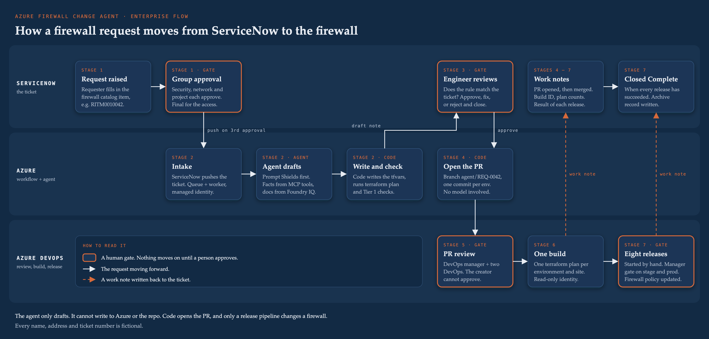
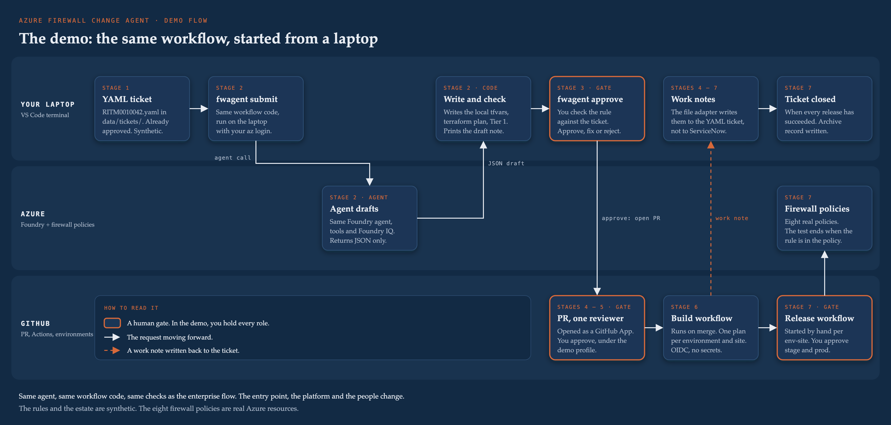

# azure-firewall-change-agent
Agentic firewall change requests on Microsoft Foundry: agent drafting, deterministic policy gates, human approval, Terraform apply.

## How a request flows



A requester asks for a firewall change in ServiceNow, and security, network and the project approve it.
The agent drafts the rule and code checks it. An engineer and the DevOps reviewers then approve it before a release pipeline changes the firewall.

## The demo



The demo runs the same agent, workflow code and checks as the enterprise flow.
One person runs it on a personal Azure subscription, so a few things change.
A YAML file stands in for the ServiceNow ticket.
You start the workflow from your laptop with `fwagent submit`.
GitHub Actions stands in for Azure DevOps, and you hold every human role.

Status: the repo, the synthetic estate and the standards are built. The workflow, the agent and the pipelines are next.

### Trade-offs

| Bend | What it gives up | Why |
| --- | --- | --- |
| **Ticket:** a YAML file in `data/tickets/` | No real catalog item, group approval or work notes in ServiceNow. | There is no ServiceNow instance for the demo. The file adapter has the same four actions a ServiceNow adapter has: get the ticket, add a work note, change the state, close it. The workflow cannot tell which one it is using. |
| **Intake:** `fwagent` on the laptop | The Azure endpoint, queue, worker and 15-minute sweep are not built, so they stay unverified. The agent call and `terraform plan` run as you, so the audit trail shows your name, not a managed identity. | Without ServiceNow, nothing pushes tickets to an endpoint. |
| **Platform:** GitHub Actions | Per-group reviewer counts and the 72-hour approval expiry become custom code. | There is no Azure DevOps access. Environment approvals are free on a public GitHub repo. |
| **People:** you hold every role | No separation of duties in the demo run. | One person runs the demo. The enterprise approval rules stay in config, and tests with synthetic identities will prove they reject a single approver. |
| **Firewall:** policies only, Basic SKU | No firewall is attached, so the test ends when the rule is in the policy. Basic has no DNS proxy and no FQDN filtering in network rules. | The subscription runs on a $150 monthly credit. |

## Synthetic data only

Every name, address and rule in this repo is fictional. A leak gate checks every commit and push for real company data, GUIDs and email addresses. To turn it on in a fresh clone:

```sh
git config core.hooksPath .githooks
mkdir -p ~/.config/leak-gate && $EDITOR ~/.config/leak-gate/terms.txt   # one real term per line; never committed
```

If the block list is missing, the gate refuses the commit rather than letting it through.
