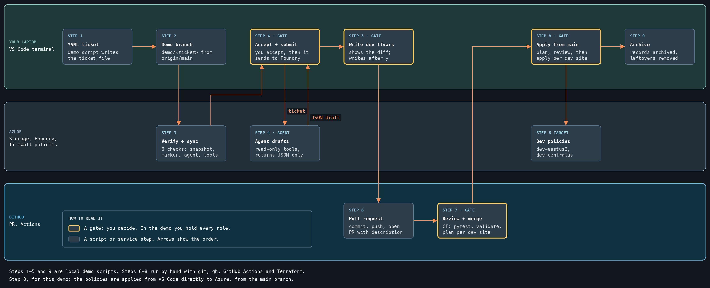
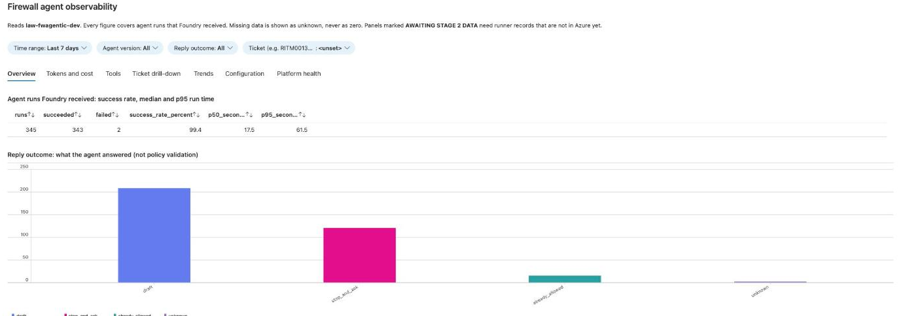
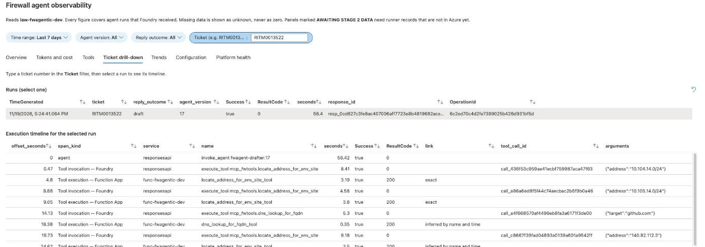
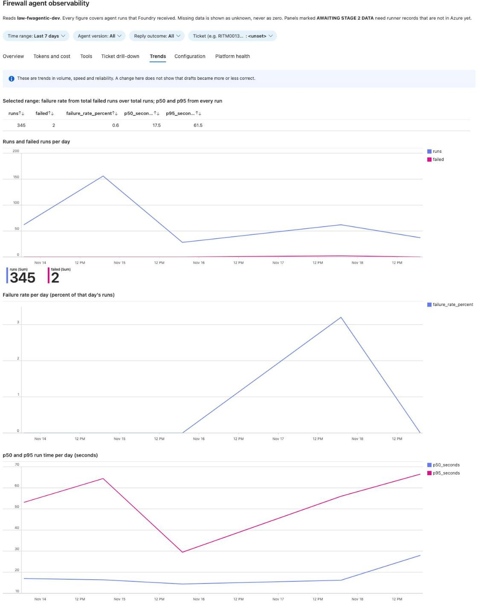

# azure-firewall-change-agent
Agentic firewall change requests on Microsoft Foundry: agent drafting, deterministic policy gates, human approval, Terraform apply.

## Problem

Turning an approved firewall change request into a correct Azure Firewall change is slow, manual work. A financial organisation handles about 100 Azure Firewall tickets a month. For each one, an engineer finds where the source and destination addresses belong, checks whether access already exists, and writes rules into the right Terraform files for the primary and disaster recovery (DR) sites.

Mistakes are costly in a regulated environment. An overly broad rule grants unapproved access. A missed site leaves primary and DR out of step.

This project has an AI agent investigate each request and draft the rules. Code checks the draft, and engineers approve every step.

## Scope

In scope:

- **Requests:** approved firewall change requests and rule removals. Each ticket selects environments (lab, dev, stage, prod) and sites (primary, DR).
- **Firewall estate:** eight environment-sites in Virtual WAN secured hubs, East US 2 (primary) and Central US (DR), each with its own Terraform folder in `infra/envs/`. Each spoke landing zone has its own rule collection group file, such as `sett.tfvars`.
- **Rule types:** network rules (TCP, UDP, ICMP, Any), application rules (HTTP, HTTPS) and DNAT rules.
- **Destinations:** IP addresses, CIDR ranges, IP groups and FQDNs. A network rule to an FQDN is resolved through DNS to IPv4 addresses.
- **Agent work:** one Foundry agent drafts rules that follow the project's security standards. Five read-only tools locate addresses, check for existing access, check DNAT ports, look up DNS and resolve environment-sites. When a ticket is ambiguous or inconsistent, the agent stops and asks the engineer.
- **Code checks:** the draft is compared with the ticket. Rules wider than approved, attempts to bypass the process and conflicting free text are stopped before any file is written.
- **Pull request:** the description names the ticket, environments, sites, Terraform files, rule collections and every rule added, changed or removed. It adds a packet-flow diagram, security-policy risks, the FQDN and its resolved addresses, an AI-assistance notice, tracking details, and the agent version, tokens, tool calls, runtime and estimated cost.
- **Delivery:** CI checks (tests, Tier 1 policy checks, Terraform plans), pull request review and a Terraform apply from `main`.
- **Observability:** each agent run is traced to Log Analytics. A workbook shows the run, every tool call, its arguments and answers, and token counts.

Out of scope for the demo:

- **Deploying beyond dev:** only the two dev firewall policies exist in Azure and are applied. Lab, stage and prod are Terraform folders the agent drafts into, not deployed policies.
- **Cost and correctness in Azure:** cost is estimated from tokens locally, and review outcomes stay in local records.

The demo's other limits are in [Trade-offs](#trade-offs): the YAML ticket in place of ServiceNow, intake on the laptop, GitHub Actions in place of Azure DevOps, one person in every role and no firewall attached.

## Status and Pending Optimization

- **Evaluation:** agent version 17 passed all 60 validation tickets across two runs (56 on 2026-11-15, 4 on 2026-11-18). It then ran the test split once on 2026-11-19: 32 of 32 passed and complete, with 0 of 7 missed stops. Earlier versions were scored on the same test tickets, so this is a regression check, not unbiased held-out evidence. Details are in `evals/README.md`.

The work below is left for the next iterations. Each item is known and planned, not ignored.

1. **Tool-result screening.** Screen tool answers, including DNS answers and text fields such as `holds`, for instructions that try to steer the agent.
2. **Prompt Shields.** Screen the ticket text before the agent runs.
3. **Token limit per request.** Stop a request that uses more than a set number of tokens.
4. **Private network access to the tools.** Move the MCP tools behind a private endpoint in the enterprise design.
5. **Threat model status.** Update `docs/threat-model.md`, where several measures that are now built still say "Planned".
6. **Release pipeline.** Replace the demo's apply from VS Code with a release workflow that applies `main` per environment-site.
7. **Observability records.** Upload the laptop's run records to two new Log Analytics tables, so the workbook can show cost, correctness and workflow events.
   - `FwAgentAttempt_CL`, one row per agent run:
     - **Which run:** ticket, run ID, attempt number, start and end time.
     - **What happened:** answered, error or not sent, and the reply (draft, already allowed, stop and ask).
     - **Tokens:** input, cached, output and reasoning, taken from Foundry's own response. These are the complete counts the workbook lacks today.
     - **Eval verdict:** passed or incorrect, plus the scorer's mistake codes. This covers evaluation runs only; demo tickets get "not applicable".
     - **What it ran on:** agent version, definition hash, tool code hash and data snapshot commit.
   - `FwAgentWorkflowEvent_CL`, workflow steps after the draft: the rules written into the tfvars files and the Tier 1 policy check in CI. Each is marked succeeded, refused or failed, per environment-site.

   Prompts, replies, labels and test-split answers are never sent. With these rows, the workbook shows:
   - **Cost:** complete token counts multiplied by a dated price list. This is still an estimate; the real bill stays in Azure Cost Management.
   - **Correctness:** pass and fail rates for evaluation runs.
   - **Drift:** whether each run used the approved agent version and tools.
   - **Workflow:** whether drafts were written and passed the Tier 1 check.

   The engineer's review decision and the Terraform plan and apply are not included. They stay in the archive evidence files.

## The demo



The demo runs the same agent, workflow code and checks as the enterprise flow, on a personal Azure subscription. You run each step from your laptop with the scripts in `evals/raj-demo/00-script`, helped by a coding assistant in VS Code. Step 4 sends the ticket to the Foundry agent.

### Cost

Estimates for the demo, checked against Microsoft pricing pages on 2026-11-17. Every resource uses its free tier or lowest plan, and the resource group has a $100 budget alert. That alert warns; it does not stop spending.

| Item | Plan or tier | Estimated monthly cost |
|---|---|---|
| Firewall policies (2, dev primary and DR) and IP groups (13) | Basic policy, no firewall attached | $0. A policy with zero or one firewall association is free. |
| Function app (MCP tools) | Flex Consumption (FC1), 512 MB, no always-ready instances | $0 within the free grant of 250,000 executions and 100,000 GB-s a month |
| Storage account | Standard LRS | Under $0.10. It holds the function package and a few KB per network snapshot. |
| Log Analytics and Application Insights | Pay-as-you-go, daily cap 0.16 GB each | $0 within the free 5 GB a month per billing account |
| Foundry account and project | S0 | $0 for the resources. The model is billed per token. |
| Managed identities, Entra apps, federated credentials, MCP connection | n/a | $0 |

**LLM tokens.** The agent runs on `gpt-6-luna` (Global Standard, eastus2) at $0.10 per million input tokens and $0.50 per million output tokens. One demo ticket uses about 14,000 tokens, about $0.002. Every evaluation and live run so far used 2,643,604 input and 136,343 output tokens, about $0.33. Each PR description reports its own tokens and estimated cost.

**Cost per request (approximations).** The agent makes one model call per ticket. The tokens grow a little with each site, because it checks addresses and existing rules at every environment-site it drafts for.

| Request | Evidence | Tokens | Tool calls | LLM cost |
|---|---|---|---|---|
| Dev primary and DR (2 environment-sites) | 15 demo PRs, RITM0013501–0013515 | 13,482–15,184 | 5–7 | $0.0016–$0.0021 |
| 4 environment-sites | 2 evaluation tickets, version 17 | about 17,200 | 11 | about $0.0023 |
| All four environments, primary (eastus2) and DR (centralus): 8 environment-sites | 1 evaluation ticket, version 17 | 19,131 | 17 | about $0.0027 |

So one request that adds a rule to every environment, including DR, costs about a third of a cent in tokens. At about 100 requests a month, that is about $0.30. The Azure side adds nothing per request: the tool calls fit in the Function app's free grant, and in this demo the firewall policies are free because no firewall is attached. In a real estate, the cost that matters is the Azure Firewall instances themselves, billed per hour whether or not a rule changes, and the engineer's review time.

**Coding assistant.** A coding assistant in VS Code helps run the demo steps. It is a flat monthly subscription billed outside Azure, so it is not included above.

Prices change and vary by region. Microsoft's own page shows the model rates only as placeholders; the token rates above come from third-party price trackers and match the rate recorded in `infra/07-foundry/deployments.tfvars` on 2026-10-15.

### Security

Security has two parts: who can sign in and act, and what the agent is allowed to believe.

**1. Entra ID authentication.** Every caller signs in with Entra ID, and no service holds a stored secret.

- The agent never has write access to Azure or the repo (ADR 0002). Only the pipeline changes the firewall.
- The MCP tools only read. Each call must carry an Entra token for the tools' app, with the `Tools.Read` app role. Three identities hold it: the Foundry agent's managed identity, the sync job's identity and, for the demo only, the person testing the tools.
- GitHub Actions signs in through federated credentials. The sync identity works only from `main`. The plan-gate identity works only for pull requests. A fork carries a different subject and is refused.
- The sync identity can deploy only the one function app (Website Contributor, scoped to that app).
- Terraform state uses Entra sign-in only, with shared access keys turned off.

**2. Prompt injection and tool results.** The ticket's structured fields are the approval. Its free text is untrusted.

- Text that asks to skip the engineer review, an approval or a required check is caught by code (`workflow/bypass.py`), not only by the agent. That finding can only be cleared by editing the ticket.
- Planted instructions that widen addresses, add ports or request extra flows are ignored. Free text that asks for traffic in an environment, site or location the ticket did not select stops the ticket with `free_text_conflict`.
- The agent takes facts from its tools, not from the text. The tools read one pinned snapshot of `main`, checked by hash before every request.
- Tool results are not screened for injected instructions yet. This will be fixed in the next iteration, as part of the optimization work (see Optimization below). Until then the risk is limited: the network data and runbooks reach `main` only through a reviewed pull request, a draft's resolved addresses must match the DNS tool's answer exactly (`workflow/scope.py`), and the draft check below still applies.
- Before any rule is written, code checks the draft against the ticket (`workflow/scope.py`). A rule wider than approved is refused.
- Evaluation tickets test injection, including validation tickets RITM0011037 to 0011040. All passed on version 17. The held-back test split has two more, which passed on the version 16 rerun.

An engineer still accepts every ticket, approves every draft and reviews every pull request. The remaining security work is listed under Optimization below.

### Observability

Every agent run is traced to Log Analytics, and an Azure Monitor workbook reads the traces. It has seven tabs. The figures below cover the 7 days to 2026-11-19.

**Overview.** Shows how many runs Foundry received, how many succeeded, how long they took and what the agent answered. There were 345 runs, and 99.4% succeeded. The agent returned 208 drafts, 120 stops to ask and 15 already-allowed answers.

Run time is shown as percentiles; "p" means percentile.

- **p50 (median):** half of the runs finished faster than this, and half slower. It is 17.5 s, so a typical run takes about 17.5 seconds.
- **p95:** 95% of runs finished faster than this, and the slowest 5% took longer. It is 61.5 s, so about 1 run in 20 takes over a minute.

The p50 shows the normal case. The p95 shows how bad the slow cases get.



**Tokens and cost.** Shows tokens per ticket and per day. Input tokens match the runner's own count. Output and cached tokens are partial, so the cost estimate uses the runner's counts.


**Tools.** Shows each MCP tool's call count, p50 and p95 time, and errors. It also shows how each Function App request was linked to its tool call: exactly, or by name and time.


**Ticket drill-down.** Type a ticket number and select a run to see its timeline. Each tool call appears twice, once as Foundry asking for it and once as the Function App running it, with its arguments and answer.



**Trends.** A row for the selected range sits above three daily charts. Its failure rate is total failed runs divided by total runs, and its p50 and p95 come from every run, not from daily figures. The charts show runs and failed runs, the failure rate, and p50 and p95 run time per day. They track volume, speed and reliability, not whether drafts became more correct.



**Configuration.** Lists the agent versions seen in Foundry traces, with run counts and first and last seen. Version 17 has 156 runs since 2026-11-15. A check against the approved baseline waits for the next iteration's records.


**Platform health.** Shows the tool server's storage warnings and host stops per day, and Log Analytics ingestion against the 160 MB daily cap. The busiest day, 2026-11-14, used 61.4 MB, 38.4% of the cap.


Cost, correctness and workflow events are not in the workbook yet. The next iteration adds them; see [Status and Pending Optimization](#status-and-pending-optimization), item 7.

### Trade-offs

| Bend | What it gives up | Why |
| --- | --- | --- |
| **Ticket:** a YAML file in `data/tickets/` | No real catalog item, group approval or work notes in ServiceNow. | There is no ServiceNow instance for the demo. The file adapter has the same four actions a ServiceNow adapter has: get the ticket, add a work note, change the state, close it. The workflow cannot tell which one it is using. |
| **Intake:** `fwagent` on the laptop | The Azure endpoint, queue, worker and 15-minute sweep are not built, so they stay unverified. The agent call and `terraform plan` run as you, so the audit trail shows your name, not a managed identity. | Without ServiceNow, nothing pushes tickets to an endpoint. |
| **Platform:** GitHub Actions | Per-group reviewer counts and the 72-hour approval expiry become custom code. | There is no Azure DevOps access. Environment approvals are free on a public GitHub repo. |
| **People:** you hold every role | No separation of duties in the demo run. | One person runs the demo. Every demo ticket is created with its security, network and project approvals already marked approved, and the ticket schema refuses one with an approval missing or pending. The enterprise rule, a DevOps manager plus two DevOps reviewers on each pull request, is not built in the demo. Its config, and tests with synthetic identities, are planned. |
| **Firewall:** policies only, Basic SKU | No firewall is attached, so the test ends when the rule is in the policy. Basic has no DNS proxy and no FQDN filtering in network rules. | The subscription runs on a $150 monthly credit. |

## How a request flows


A requester asks for a firewall change in ServiceNow, and security, network and the project approve it.
The agent drafts the rule and code checks it. An engineer and the DevOps reviewers then approve it before a release pipeline changes the firewall.

## Synthetic data only

Every name, address and rule in this repo is fictional. A leak gate checks every commit and push for real company data, GUIDs and email addresses. To turn it on in a fresh clone:

```sh
git config core.hooksPath .githooks
mkdir -p ~/.config/leak-gate && $EDITOR ~/.config/leak-gate/terms.txt   # one real term per line; never committed
```

If the block list is missing, the gate refuses the commit rather than letting it through.
